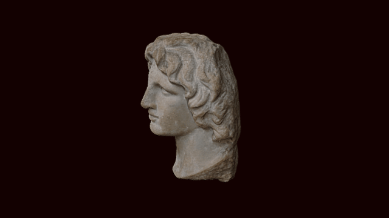

 

# 3D model of a bust of Alexander the Great

3D data for recreation of a British Museum object.

Marble portrait head of Alexander the Great: the head was cut to fit into a separately made body. The surface is in good condition with only minor abrasions. The back of the head has been worked to receive the remainder of the hair, which was probably made of another material, such as stucco or plaster.
COL: GAA8293

# LICENSE

The contents of this repository are licensed under CC-BY-NC-SA

# Credits

Photographs and models by Daniel Pett <dpett@britishmuseum.org>, Digital Humanities Lead, British Museum

Copyright Trustees of the British Museum
